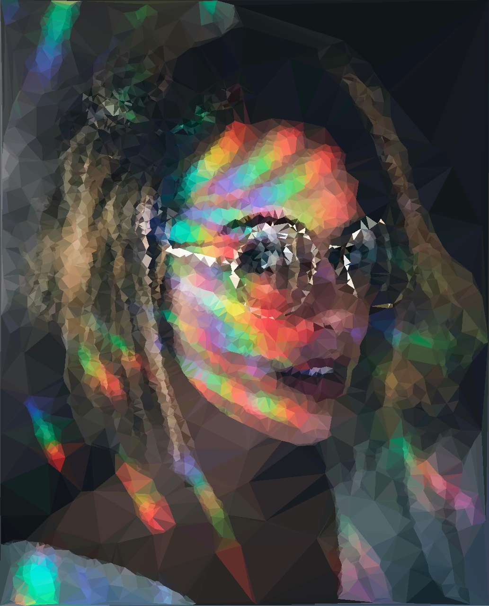
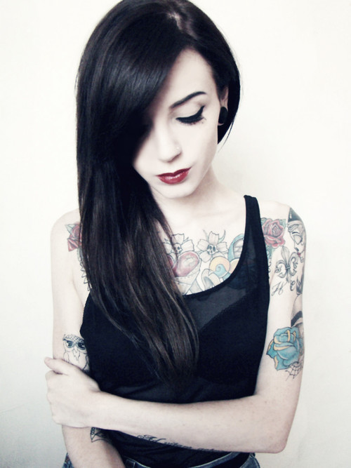
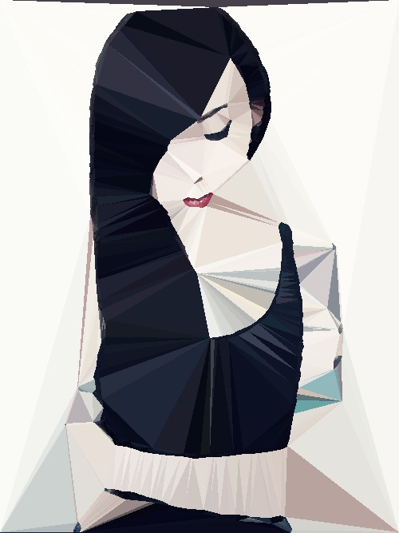
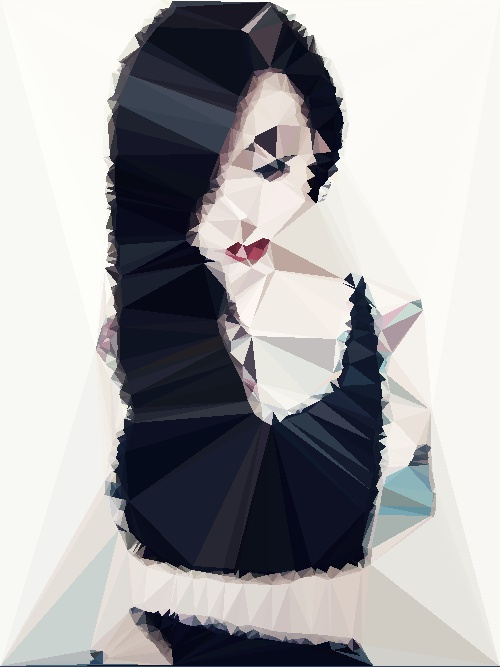
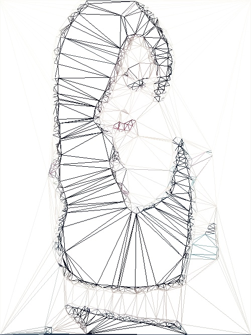
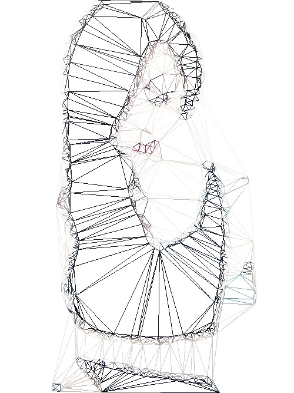

# DelaunayImage

[](https://travis-ci.org/Ernyoke/DelaunayImage)

## Description
Generate artistic images using [Delaunay](https://en.wikipedia.org/wiki/Delaunay_triangulation) triangulation algorithm.



### Procedure:
1. Blur the original image using *Gaussian blur* algorithm.
2. Create a grayscale image from the blurred image.
3. Detect edges  using sobel or laplacian algorithm.
4. Apply a threshold on the image containing the edges of the original image. This serves as a noise reduction procedure.
5. Get the remaining points and create a *Delaunay* mesh using the [Bowyer-Watson](https://en.wikipedia.org/wiki/Bowyer%E2%80%93Watson_algorithm) algorithm.
6. Reconstruct the image using the *Delaunay* mesh.

## Build

**Java 1.8** is necessary to be able to build the project!

```
git clone https://github.com/Ernyoke/DelaunayImage.git
mvn assembly:assembly -DdescriptorId=jar-with-dependencies
```

### Dependecies
* OpenCV
* JUnit5

## Example of usage

```
----Usage---

java -jar delaunay.jar <intput path> <output path> [args]

Mandatory (stationary) arguments: <input path> <output path>.
<input path>: path to the input image. Extensions supported: .jpg, .jpeg, .png
<input path>: path to where the output image should be saved. Extensions supported for the output image: .jpg, .jpeg, .png

Example of usage: java -jar delaunay.jar in.png out.png 

-bk <nr>: blur kernel size, <nr> should be a positive odd integer. Default value: 35 
-t <nr>: threshold value, <nr> should be a positive integer between 0 and 255. Default value: 200
-max <nr>: maximum number of points, <nr> should be a positive integer. Default value: 1000 
-ea <alg>: edge detection algorithm, accepted values for <arg> are: sobel, laplacian. Default value: sobel 
-sk <nr>: sobel kernel size, should be a value from the following set: [1, 3, 5, 7]. Default value: 3 
-grayscale: setting this flag, the output image will be grayscale. Default value: false 
-verbose: activate console logging. Default value: false 

Examples: 
Example of usage: java -jar delaunay.jar in.png out.png -ea laplacian -sk 5 -max 2000 -t 200 -v 
Example of usage: java -jar delaunay.jar in.png out.png -max 2000 -grayscale 
```

## Output examples
| Original | java -jar delaunay.jar in.jpg out.jpg -max 2000 -t 150 -grayscale |
| --- | --- |
| |  |
| java -jar delaunay.jar in.jpg out_color.jpg -ea laplacian -sk 5 -max 2000 -t 200 | java -jar delaunay.jar in.jpg out_color.jpg -max 1000 -t 150 |
|  |  |
| java -jar delaunay.jar in.jpg wire.jpg -wire | java -jar delaunay.jar in.jpg wire.jpg -wire -dbf |
|  |  |
## Tips and tricks
* Laplacian algorithm is very sensitive to noise. Try to smooth out noise by using the right kernel size and sigma values.
* The number of the triangles is determined by the number of the *-max* points. This will also influence the average area size of the triangles.
Smaller numbers of triangles will result in bigger ares and probably picture information loss.
* -v Verbose mode logs out every step of the procedure.

## License
This project is under the MIT License. See the LICENSE file for the full license text.
